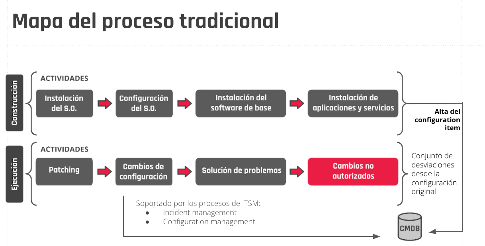
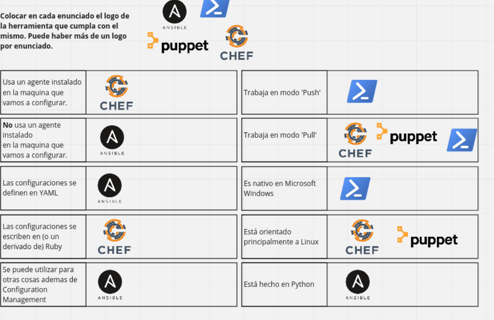
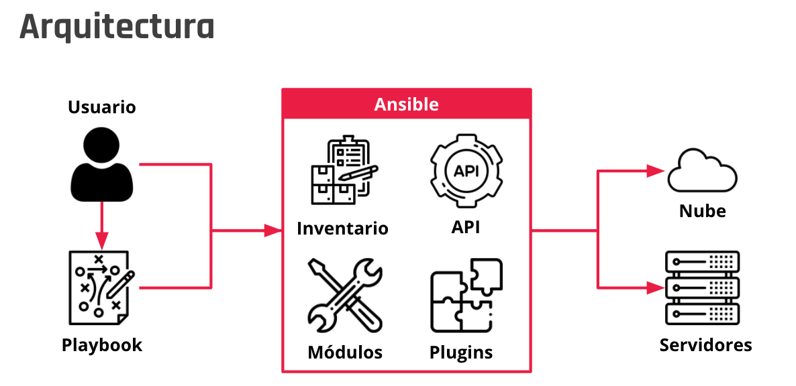
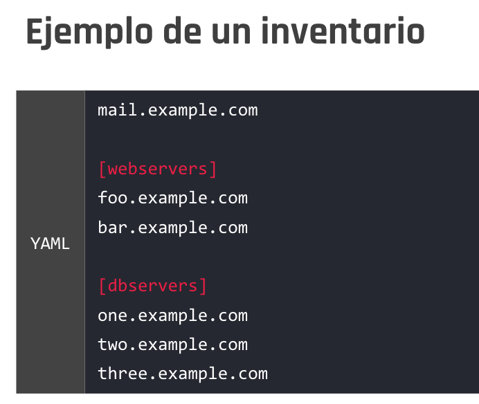
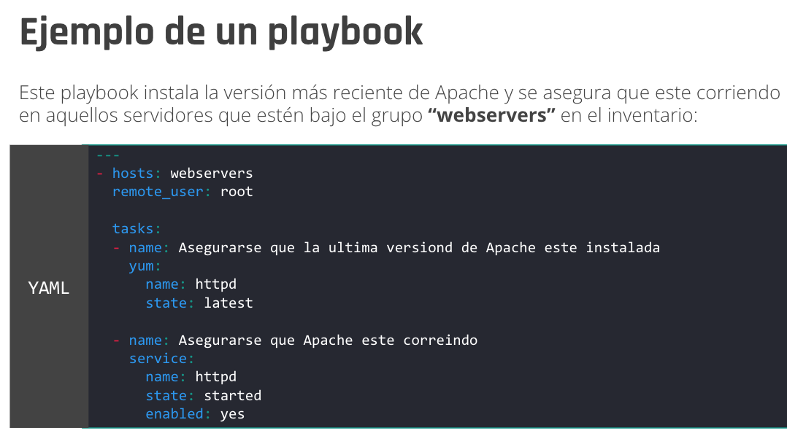
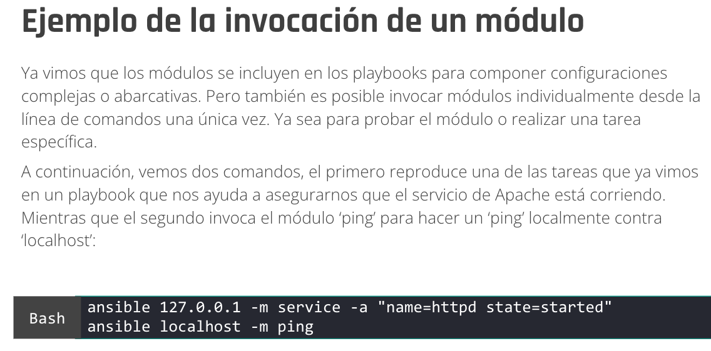
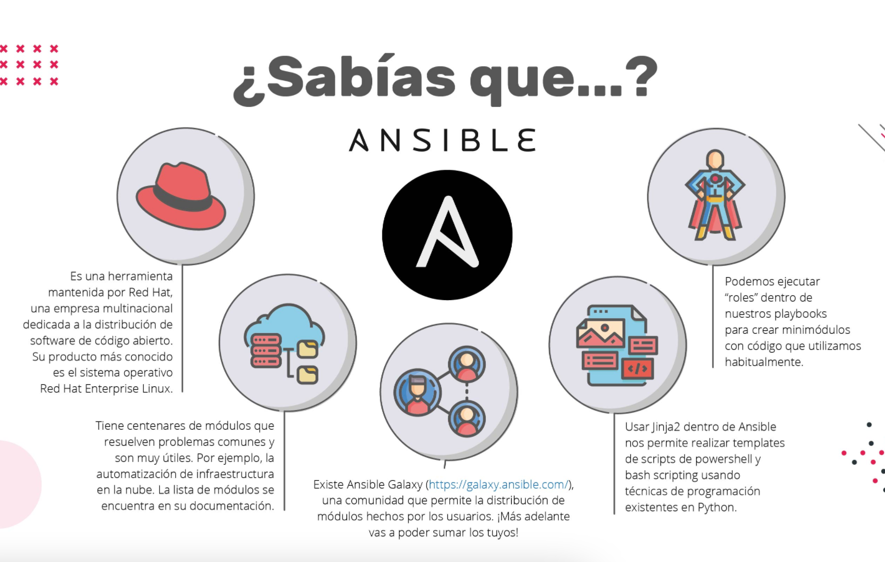

##### Notas tomadas durante las clases sincronicas y asincronicas.
---
# <span style="color:lightgreen;">Modulo 1</span>
## <span style="color:violet;">Clase 1</span>
----
### <span style="color:purple;"> _Notas del material_</span>
#### Introduccion a la materia 
¿Qué es infraestructura de IT?</br>
La infraestructura de tecnología de la información, o infraestructura de IT, se refiere a los componentes combinados necesarios para el funcionamiento y la gestión de los servicios de IT de la empresa y los entornos de IT.


¿Por qué es tan importante la infraestructura de IT?
La tecnología es el motor de prácticamente todos los aspectos de las empresas actuales. Desde el trabajo de un empleado individual hasta las operaciones de bienes y servicios. Si se conecta correctamente, la tecnología se puede optimizar para mejorar la comunicación, crear eficiencia y aumentar la productividad.

Si una infraestructura de IT es flexible, fiable y segura, puede ayudar a una empresa a cumplir sus objetivos y a ofrecer una ventaja competitiva en el mercado. De forma alternativa, si una infraestructura de IT no se implementa correctamente, las empresas pueden afrontar problemas de conectividad, productividad y seguridad, como infracciones e interrupciones del sistema. En general, contar con una infraestructura correctamente implementada puede ser un factor clave para la rentabilidad de un negocio.

Con una infraestructura de IT, una empresa puede:

- Ofrecer una experiencia del cliente positiva proporcionando acceso ininterrumpido a su sitio web y la tienda en línea.
- Desarrollar y lanzar soluciones al mercado con rapidez.
- Recopilar datos en tiempo real para tomar decisiones rápidas.
- Mejorar la productividad de los empleados.

</br>

### <span style="color:purple;"> _Notas de clase_ </span>
La arquitectura cliente servidor esta compuesta por trees pilares el servidor, middleware y el cliente.

Detallar que hace cada uno
el Middleware es el que se encarga de hacer todo el proceso de por medio entre el click de un cliente y la respuesta del servidor.
Por ejemplo una API, dbms. 

--> Actividad en clase en Jamboard en este [Link](https://jamboard.google.com/d/1YSi-O1wf46oiqJAOVtJmUOmIvHur9i7LiNlk8Eychks/edit?usp=sharing)

</br>

# <span style="color:lightgreen;">Modulo 2</span>
## <span style="color:violet;">Clase 2</span>
----
### <span style="color:purple;"> _Notas del material_</span>

... </br>

### <span style="color:purple;"> _Notas de clase_ </span>
Automatizar:
Beneficios: 
- Elevar la productividad empresarial.
- Reducir costos operativos.
- Disminuir los riegos de fallas.
- Elevar la seguridad de la informacion.
- Tener una mejor capacidad de respuesta.
- Facilidad de adaptacion.
- Alojar una mayor cantidad de datos.
- Elevar la competitividad del negocio.

Virtualizacion: evaluar la compatibilidad y los distintos entornos. 

Provisioners y Providers

Interfaz de comandos: https://www.vagrantup.com/docs/cli
https://app.vagrantup.com/boxes/search

actividad de clase crear la maquina virtual debian con vagrant y tambien de forma manual.

----
## <span style="color:violet;">Clase 4</span>
----
### <span style="color:purple;"> _Notas del material_</span>
Introduccion a la terminal de linux
Comandos utiles:</br>
[LINK ](https://cheatography.com/davechild/cheat-sheets/linux-command-line/)a la cheatsheet de los comandos mas usados.</br>
```mkdir dir1``` genera una carpeta con el nombre dado (en este caso dir1).</br>
```touch dir1/archivo_1.txt``` crea un archivo en el lugar indicado. </br>
```ls -R ``` se listan todos los directorios. </br>
```ls ``` enlista los diferentes archivos de un directorio. </br>
``ls -a `` enlista todo el contenido dentro del directorio incluyendo elementos que se encuentren ocultos.</br>
`ls -l` enlista el contenido e incluye informacion referente a cada elemento.</br>
`rmdir ` elimina un directorio. </br>
`rm ` elimina archivos sueltos. </br>
`rm dir1/archivo_1.txt` aca se elimina el archivo especifico dentor del dir1.</br>
`rm -r dir2` con el modificador -r eliminamos el dir2 y todo su contenido.</br>
`cp ` se pueden copiar archivos y directorios, asi como ubicarlos en otras rutas, definiendo origen primero y luego el destino. </br>
`mv` se usa para mover archivos</br>
`locate ` nos localiza un archivo con el flag `-i` nos busca el archivo independientemente de las mayusculas o minusculas del nombre.</br>
`find` nos permite decirles que ejecute comandos a parte de buscar el archivo o la carpeta. </br>

+++ faltan agregar algunos comandos 
</br>

### <span style="color:purple;"> _Notas de clase_ </span>
+ La actividad de las mesas se realizo en la maquina virtual. 

---
## <span style="color:violet;">Clase 5</span>
----
### <span style="color:purple;"> _Notas del material_</span>
Shell srcipting:</br>
Bash es una interfaz interprete (que interpreta las ordenes que el usuario le hace al sistema) en la consola de Unix, tambien se pueden realizar a traves de un archivo llamado srcipt. </br>
bash hereda sh, zsh y csh, es la interfaz determinada actualmente en gnu/linux y macos (unix).
</br>
Escribimos en la consola....</br>
Tipos de variables: </br>
Globales o de entorno</br>
    El sistema Linux establece algunas varibales de entorno globales cuando inciamos sesion en nuestro sstema y siempre son en LETRAS MAYUSCULAS. Si queremos ver las variables de entorno que estamos usando y que estan cargadas en nuestra sesion, escribimos le comando printenv o env en nuestro shell.</br> 
    Para declara una variable global se escribe</br>
    ` export NOMBERVARIABLE=valor ` </br>
    Para acceder a la misma utilizamos la sentencia `$NOMBREVARIABLE` </br>
De usuarios o locales</br>
    Las varibales del tipo usuario o lacl tienen la particularidad que pueden ser accedidas solo por el usuario y la sesion en la que fueron creadas. Una variable local se declara de la forma sencilla:</br>
    `nombrevariable=valor`</br>
    Para acceder a la misma utilizamos la sentencia: `$nombrevariable`.  </br>

 --> VER estructuras de control en bash 
Pruebo en VM. 
</br>

### <span style="color:purple;"> _Notas de clase_ </span>

Hacemos dos scripts llamando a dos apis.

---
## <span style="color:violet;">Clase 6</span>
----
### <span style="color:purple;"> _Notas de clase_ </span>
Cierre de semana: Hacemos un script llamando a una api similar al de la clase 5.

---
## <span style="color:violet;">Clase 7</span>
----
### <span style="color:purple;"> _Notas del material_</span>
Intro a Powershell</br>
Comandos `cmdlet` --> retorna una instancia de un objeto.</br>
+ comandos extensibles
+ alias de comandos 
+ se pueden crear nuevos cmdlet
Powersell se utiliza para:
- Automatizar
- Compilar
- Probar
- Implementar
Mas caracterisitcas de poweshell:</br>
- extensible mediante funciones, clases, scripts y modulos.
- Sistema de fomrmato extensible para una salida facil.
- Sistema de tipos extensible para crear tipos dinamicos.
- Compatibilidad integrada con formatos de datos comunes.
--> Poweshell es un proyecto de codigo abierto. </br>
</br>
Los usos mas comunes de powershell son:</br>
+ Automatizacion de tareas: PowerShell sirve para facilitar a los administradores de sistemas las tareas de automatización, administración y configuración de sistemas. 
+ Configuratio management: Al utilizar PowerShell DSC.</br>
+ Monitoreo: Para escribir scripts que pueden ser utilizados por un software de monitoreo. </br>
+ Testear infraestructura: Las pruebas de infraestructura en Pester son código de PowerShell que ejecuta el módulo Pester PowerShell y se crea de una manera específica, conocida como lenguaje específico de dominio (DSL). Este DSL describe el estado deseado y tiene el código necesario para verificar ese estado y comparar el resultado.<br>
+ Automatización de procesos:Automatizar tareas en un proceso de liberación de software (CI/CD).</br>
<br>
Como utilizar un modulo de poweshell???</br>
1er. Instalar el modulo. </br>
2do. Buscar los comandos que agrego el modulo.</br>
3er. Utilizar los comandos que agrego el modulo. </br>
</br>
Como encontrar modulos instalados??
Comandos:
... </br>

### <span style="color:purple;"> _Notas de clase_ </span>
Utilizamos powershell para resolver lo ejercicios pedidos. </br>

---
## <span style="color:violet;">Clase 8</span>
----
### <span style="color:purple;"> _Notas del material_</span>

... </br>

### <span style="color:purple;"> _Notas de clase_ </span>
Python:</br>
Jugue con los operadores de python en el archivo dentro de la carpeta `./C8/play.py `

---
## <span style="color:violet;">Clase 9</span>
----
### <span style="color:purple;"> _Notas de clase_ </span>
Cierre de la semana:.
Change managment y config. managment son dos procesos fundamentales del conjunto de metodologias conocido como ITIL. En caso de que se quiera volver para atras hay un registro.</br>
En el enfoque tradicional se usa un sistema de tickets.

---
## <span style="color:violet;">Clase 10</span>
----
### <span style="color:purple;"> _Notas del material_</span>
>"Configuration management y change management son dos de los procesos fundamentales del conjunto de metodologías conocido como ITIL."</br>

Change Managment:</br>
ITIL describe la gestión de cambios como el proceso de controlar y gestionar un cambio a lo largo de todo su ciclo de vida con el objetivo de minimizar el riesgo.

¿Qué es un cambio?

Según ITIL, un cambio es la modificación o eliminación de cualquier cosa que pueda afectar directa o indirectamente los servicios. Básicamente, cualquier cambio en la infraestructura de IT de una organización puede afectar las operaciones de la organización.

Ejemplos de un cambio: reemplazo de hardware, instalación de software en un servidor o la modificación de una configuración de un sistema que alterará su comportamiento.

Configuration Managment:</br>
Es el proceso que permite gestionar los cambios de configuración de nuestros activos informáticos —ya sean de software o hardware—, permitiendo a la organización mantener un registro histórico y a su vez aplicar controles —como un proceso de aprobación para cambios que cumplan con determinadas características—. 

Cada uno de los activos informáticos en el contexto de este proceso se los conocen como configuration items (CI) y se almacenan en lo que es llamado CMDB (configuration management database).

Ambos procesos se complementan, ya que change management aporta a la gobernabilidad de los cambios que se efectúan en el parque tecnológico de una organización, y configuration management nos permite gestionar una base de datos (CMDB) con la informacion de nuestros activos (CIs) y un historial de los cambios realizados para cada uno de ellos.

De esta manera, de ocurrir la falla de uno de nuestros activos que nos fuercen a restaurarlo, por ejemplo, una falla crítica en un servidor, el proceso de configuration management nos aporta una vista de todos los cambios sucedidos para ese activo desde su creación, y así permitirnos reproducir cada uno de los cambios y devolverlo al estado anterior a la falla.


</br>
</br>

>Un cambio no autorizado que es implementado con éxito es más peligroso que uno que no lo es. Ya que produce una configuración efectiva sin dejar evidencia de la misma.


</br>
Herramientas de configuration management</br>

| -                           | Chef             | Puppet                                                                                              | PowerShell DSC                                                             | Ansible                                                   |
|-----------------------------|------------------|-----------------------------------------------------------------------------------------------------|----------------------------------------------------------------------------|-----------------------------------------------------------|
| Arquitectura                | Cliente-Servidor | Cliente- Servidor                                                                                   | Cliente-servidor o  standalone                                             | -                                                         |
| S.O. orientado              | Linux            | Linux                                                                                               | Windows Server, es multiplataforma y puede también configurar hosts Linux. | desarrollada en Python                                    |
| Modo de funcion del cliente | "pull"           | "pull"                                                                                              | C-s(pull) o st(push)                                                       | -                                                         |
| Lenguaje de configuraciones | Ruby             | un DSL (domain specific language) creado por Puppet labs.                                           | lenguaje de scripting PowerShell.                                          | archivos con formato YAML (un superset del formato JSON). |
| Diferencias                 | -                | La gran diferencia entre Puppet y Chef está dada por las capacidades de reporting que tiene Puppet. | -                                                                          | -                                                         |

</br>


### <span style="color:purple;"> _Notas de clase_ </span>
Realizamos actividad de cuadro comparativo en las mesas de las herramientas del consifguration managment.</br>


---
## <span style="color:violet;">Clase 11</span>
----
### <span style="color:purple;"> _Notas del material_</span>
¿Qué es Ansible y para qué sirve? 
Se trata de un software de gestión de la configuración automática y remota, que nos permite centralizar la configuración de numerosos servidores, dispositivos de red y cloud providers de una forma sencilla y automatizada.</br>
Datos de la herramienta:
- Ansible es una herramienta open source de configuration management y de aprovisionamiento, similar a Chef, Puppet o Salt.
- Usa SSH para conectarse a los servidores y ejecutar las tareas de configuración. Ansible nos permite controlar y configurar nodos desde un servidor central.
- Lo que lo hace diferente de otras herramientas de configuration management es que Ansible utiliza la infraestructura de SSH. El proyecto se originó en 2013 y, finalmente, fue comprado por Red Hat en 2015.

¿Por qué elegir Ansible?
- No usa agentes: Mientras que al equipo que queramos configurar se pueda acceder vía SSH y correr Python, se podrá configurar usando Ansible. 
- Idempotente: Toda la arquitectura de Ansible está estructurada alrededor del concepto de idempotencia. La idea es que solo se harán configuraciones si son necesarias y que se podrán aplicar de manera repetible sin provocar efectos secundarios.
- Declarativo: A diferencia de un script, en donde debemos escribir la lógica necesaria para efectuar una configuración, Ansible trabaja por nosotros, dejándonos escribir una descripción del estado que deseamos para un servidor o conjunto de servidores. Es luego Ansible el que se encarga de aplicar dicha descripción de forma idempotente.
- Fácil de aprender.

Arquitectura: 



Inventario:
- El inventario es una lista de los nodos que pueden ser accedidos por Ansible. Por defecto, el inventario está soportado por un archivo de configuration, cuya ubicación es /etc/ansible/hosts
- Los nodos pueden estar listados por nombre o IP.
Cada nodo es asignado a un grupo, como pueden ser “web servers”, “db servers”, entre otros. 
- El  inventario debe estar escrito en uno de muchos formatos, estos pueden ser YAML, INI, etcétera. YAML es el formato más utilizado en la industria.</br>
Ejemplo:


Playbooks:</br>
Los playbooks son archivos también escritos en formato YAML. Estos archivos son la descripción del estado deseado de los sistemas que vamos a configurar. Ansible es el que hace todo el trabajo para llevar los servidores al estado que nosotros hayamos especificado sin importar el estado en el que estén cuando la configuración se aplique. Los playbooks hacen que las nuevas instalaciones, actualizaciones y la administración del día a día sea repetible, predecible y confiable.
- Los playbooks son simples de escribir y mantener. Se escriben en un lenguaje natural por lo que son muy sencillos de evolucionar y editar.
- Los playbooks contienen Plays (jugadas).
- Las jugadas (contienen tareas (en inglés, tasks).
- Las tareas invocan módulos.</br>
Ejemplo:


Modulos:</br>
- Hay más de 1000 módulos incluidos con Ansible para automatizar las diferentes partes de nuestro ambiente. Se puede pensar en los módulos como los plugins que hacen el trabajo real de configuración. Cuando se ejecutan las tareas escritas en un playbook, lo que se está ejecutando es en realidad un módulo. 
- Cada módulo es independiente (no debería tener dependencia de otros módulos) y se lo puede escribir en cualquiera de los lenguajes de scripting standard de mercado (Python, Perl, Ruby, Bash, etc.). Uno de los principios de diseño de los módulos es la idempotencia.
- Dentro de los módulos más populares podemos encontrar: Service, file, copy, iptables, entre otros.

Ejemplo:


Herencia de python</br> Ansible está desarrollado en Python y, en consecuencia, hereda y/o implementa algunos aspectos del lenguaje. Y si bien, no es necesario ser desarrollador de Python para poder hacer uso de Ansible. Hay algunas cuestiones que es importante conocer:
- El lenguaje de templating (Jinja2)
- Operador ternario: El operador ternario de Python se puede utilizar dentro de los templates de Jinja para alterar algunos comportamientos de nuestros playbooks en función de ciertas condiciones.
- Errores: Muchas veces los errores que encontremos van a estar en un formato que, de estar familiarizados con Python, nos resultará más sencillo de leer.

Casos de uso ansible:</br>
- Aprovisionamiento: Utilizar Ansible para instanciar servidores o máquinas virtuales “configurando el sistemas de virtualización”.
- Configuration management: gestionar y mantener las configuraciones de nuestros servidores.
- App deployment: distribuir aplicaciones.
- Continuous delivery: Utilizarlo como componente de un proceso de CI/CD para automatizar el despliegue de una aplicación luego de su proceso de compilación.
- Seguridad y compliance: La naturaleza idempotente de Ansible hace que podamos utilizarlo para distribuir configuraciones asociadas con la seguridad sin importar la configuración actual. 
- Orchestration: Puede ser utilizado también para orquestar operaciones en la nube o ‘configurar’ la nube.

Configuration management con Ansible</br>
Ansible es la herramientas más simple para implementar una estrategia de configuration management. Está diseñado para ser minimalista, consistente, seguro y altamente confiable. Cualquier desarrollador, tester o administrador de infraestructura puede fácilmente utilizarlo para configurar un conjunto de nodos. Además, cualquier persona en el departamento de IT podría escribir un playbook sin mayores dificultades.</br>
Las configuraciones descritas en Ansible (playbooks) son sencillamente una descripción de la infraestructura (en un lenguaje fácilmente inteligible para el ojo humano) de modo que cualquier persona en el área de IT podría entender el significado de cada tarea en un playbook.</br>
Ansible solo requiere el password o la clave privada del usuario que se utilizará para acceder desde Ansible a los sistemas que se configuraron. 
</br>


</br>


### <span style="color:purple;"> _Notas de clase_ </span>
La profe trabajo sobre el contenido de playground e intento hacer el ej del playground clase 11A seccion "Ansible en accion".</br>

---
## <span style="color:violet;">Clase 12</span>
### Evaluacion. 


---

# <span style="color:lightgreen;">Modulo 2</span>
## <span style="color:violet;">Clase 13</span>
----
### <span style="color:purple;"> _Notas del material_</span>
Docker en profundidad:</br>
Containers: </br>
Entrornos fisicos: 
- 
Entornos virtuales:
- 
MIX (virtuales y fisicos):
- algo
Que es Docker?</br>

</br>
Vocabulario de Docker</br>
Te dejamos algunos conceptos que serán importantes que reconozcas para que te familiarices con ellos:

- Host: una máquina virtual que ejecuta Docker daemon para alojar una colección de contenedores Docker.
+ Cliente: aquí se ejecutan los comandos que están siendo ejecutados. (cliente-servidor).
+ Imagen: una colección ordenada de sistemas de archivos (capas) que se utilizarán al crear una instancia de un contenedor.
+ Contenedor: una instancia en tiempo de ejecución de una imagen.
+ Registro: una colección de imágenes de Docker.

Que es un Dockerfile?

### <span style="color:purple;"> _Notas de clase_ </span>
Hacemos un ej en Docker.


## <span style="color:violet;">Clase 14</span>
----
### <span style="color:purple;"> _Notas del material_</span>
Ecosistema Docker:</br>
Docker HUb --> repo de imagenes/ templates con los que puedo contruir contenedores que va a correr o ejecutarse en un segundo plano. </br>
### <span style="color:purple;"> _Notas de clase_ </span>

## <span style="color:violet;">Clase 15</span>
----
Fin de Semana.
