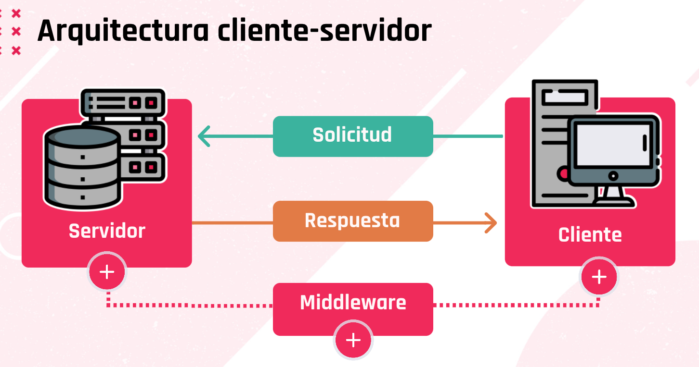
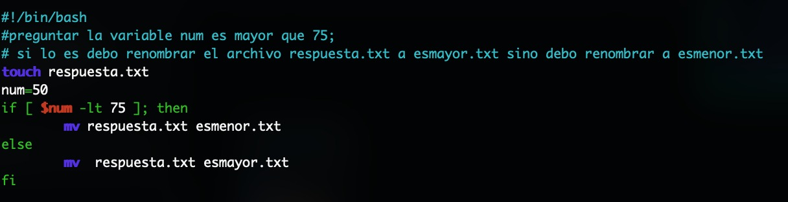

Preguntas tipo parcial:

### ¿Cuales son las tareas de automatización?
Tareas de Automatización
- Aprovisionamiento de las áreas de TI: automatiza el proceso para habilitar maquinas a través de un levantamiento de servicios para el personal nuevo de nuestra organización.
- Gestión de configuración: ahorra tiempo y trabajo al automatizar la configuración de las maquinas que se habilitan de acuerdo con los objetivos que tenga el área de TI.
- Seguridad y cumplimiento: Estable acciones de políticas de seguridad y cumplimiento automatizables en la gestión de las máquinas.
- Organización de la nube: Asegura la información y mantiene la disponibilidad de ella a través de la automatización para generar mayor eficiencia.
- Implementar aplicaciones: Algunas aplicaciones requieren instalarse o configurarse, esta tarea puede ser automatizada en las áreas de TI.

### Comando tcpdump ¿para qué sirve?
Aplicación que nos sirve para monitorear laconexión de red (analizar trafico de red).

### Comandos tipicos de Bash:
- `cp` (copy archives)
- `mkdir` (creates a directory [una carpeta])
- `sudo` (eleva privilegios)
- `su` (cambiar de usuario)
- `rmdir ` elimina un directorio. 
- `ls` enlista los elementos en el directorio en el que nos econtramos parados

### Bash se puede usar para...
Automatización de tareas administrativas y Automatización de procesos

### ¿Para qué se utiliza el comando Get-Help?
Para conocer más acerca de los cmdlets y sus funciones

### sudo y su son difrentes:
- sudo: comando que sirve para aplicar permisos de superusuario al usuario que estamos
usando.
- su: comando que sirve para cambiar de usuario (no necesariamente cambiar al root).

### ¿Para qué sirve el comando sudo?
Para elevar privilegios (convertirte en dios linux)

### Para que sirve powershell
Automatización de procesos, Configuration Managment, Automatización de tareas

### PowerShell Core es...
Un lenguaje de scripting que viene con una consola multiplataforma integrada cuando se instala (en windows y capaz linux 'H'.)

### Comandos Powershell: 
- NO Invoke.
- SI comandos como Get-Helpy Get-Command.

### ¿Para qué sirve la virtualización?

### ¿Servicios de publicacion web?
- Apache
- NGINX

### ¿Apache? 
- Es un servidor web. Nos permite alojar páginas web en internet.

### ¿Cuáles de todas estas tecnologías no es un Hypervisor de Virtualización?
X VmWare (NO)
:) Apache (SI)
:) Vagrant (SI)
X VirtualBox(NO)

### ¿ Cuáles de los siguientes elementos forman parte del sistema operativo ?
Nucleo (SI)
Interfaz Grafica (SI)
Aplicacion (NO)
Core (NO)

### % de utilización de SO en Servidores Web
- 75% Linux y 25% Windows. (Recordar que en elgrupo de los UNIX (o UNIX-like) tenemos a: GNU Linux, FreeBSD, macOsServer...)

### Arquitectura cliente – servidor: 
</br>

### Función del middleware.
Se encarga del transporte de los mensajes entre el cliente y el servidor

### Dentro de los middleware tenemos a los:
API , DBMS

### ¿Cómo se denomina la parte del software que se encarga del transporte de los mensajes entre el cliente y el servidor?
MiddleWare


### ¿Cuáles de las siguientes afirmaciones sobre el modelo cliente-servidor son correctas?
El servidor se inicia al recibir el mensaje del cliente. (NO)
El clientes es el que recibe datos.(NO)
El servidor es el que recibe datos.(SI)
El servidor siempre esta en escucha.(SI)

### Un cliente..............servicio.
...realiza una petición a un...
... consume un ...

### Las tolerancias a fallos de un S.O. son:
La posibilidad de seguir operando ante los fallos y la posibilidad de que otro servidor tome nuestro rol en caso de caída.

### ¿Qué sistemas operativos hacen uso de un kernel?
Linux, Windows

### ¿qué es ITIL? 
ITIL describe la gestión de cambios como el proceso de controlar y gestionar un cambio a lo largo de todo su ciclo de vida con el objetivo de minimizar riesgos.


### ¿Qué es Configuration management y change management?
- Configuration management es el proceso que permite gestionar los cambios de configuración de nuestros activos informáticos, permitiendo a la organización mantener un registro histórico y a su vez aplicar controles.
- Un cambio es la modificación o eliminación de cualquier cosa que pueda afectar directa o indirectamente a los servicios.

### ¿En qué run level inicia la consola de Linux? 
- Nivel 1.

### Las variables globales de Linux.
se escriben en mayusculas

### ¿En Linux se puede tener múltiples espacios de trabajo?
- Sí, para ingresar hacemos Ctrl+Alt+F1, etc.

### ¿ Es Python es orientado a objetos, multiparadigma, scripting? 
Si.

### En Pyhton, el identado me sirve para
Declarar que un grupo de sentencias pertenecen a grupo o bloque de código

### ¿Cuál es la manera correcta de definir una variable en Python?
a = 5

### Explique CON SUS PALABRAS los principales beneficios al virtualizar sistemas.
Virtualizar nos da la posibilidad de utilizar o probar diferentes sistemas operativos por
ejemplo para crear un entorno de prueba para aplicaciones que estemos creando y ver
cómo se comportan en los diferentes sistemas operativos o bajo ciertas condiciones.
También reduce los costos, ya que si necesitamos un servidor pero no tenemos los
recursos de hardware o financieros para dedicar exclusivamente una computadora a ese
uso, podemos utilizar alguna computadora que tengamos, aprovechando los recursos de
hardware que ya tenemos.

### Explique CON SUS PALABRAS que son las distribuciones de Linux.
Existen diferentes distribuciones de Linux, algunas de ellas para uso domestico (por
ejemplo Debian y Ubuntu) y otras versiones para uso como servidores (por ejemplo GNU
Linux, FreeBSD, MacOsServer). 

### Explique CON SUS PALABRAS Configuration Managment.
Existen diferentes distribuciones de Linux, algunas de ellas para uso domestico (por
ejemplo Debian y Ubuntu) y otras versiones para uso como servidores (por ejemplo GNU
Linux, FreeBSD, MacOsServer).

### Explique CON SUS PALABRAS la arquitectura CLIENTE - SERVIDOR


### Explicar CON SUS PALABRAS alguna de las tareas más comunes para automatizar en TI. Ejemplifique
Las 5 tareas más comunes en IT para automatizar
-	Aprovisionamiento de las áreas de IT: Automatizar el proceso para habilitar maquinas a través de un levantamiento de servicio para el personal nuevo de nuestra organización
-	Gestión de configuración: Ahorra tiempo y trabajo al automatizar la configuración de las maquinas que se habilitan de acuerdo con los objetivos que tenga el área de IT
-	Seguridad y cumplimiento: Estable acciones de políticas de seguridad y cumplimiento automatizables en la gestión de las maquinas
-	Organización de la nube: Asegura la información y mantiene la disponibilidad de ella a través de la automatización para generar mayor eficiencia 
-	Implementar acciones: Algunas aplicaciones requieren instalarse o configurarse, esta tarea puede ser automatizada

### Explique CON SUS PALABRAS porque es importante gestionar a la infraestructura como GANADO y no como MASCOTAS.
Se dice que, en los procesos tradicionales, cada servidor es administrado de manera individual y se convierte en una mascota, con un trato personalizado.
En los procesos modernos de administración de servidores, los mismos se administran en conjunto, con una mirada mas industrial y abarcativa del parque tecnológico. Se adopta un enfoque que nos permite implementar soluciones rápidas y reemplazar componentes fallidos en lugar de invertir tiempo en intentar resolver problemas complejos. Similar a como sucede en la ganadería.


### Corregir el Vargantfile Debo instanciar una maquina virtual con las siguientes características: 4 GB de RAM, SIN Interfaz gráfica, Sistema Operativo Debian(cualquier version) y conectado a la red publica. Nuestro Vagrantfile base esta en: https://github.com/repoinfradh/deploy_app/blob/main/VagrantfileTwo
BASE
```
 # -*- mode: ruby -*-
# vi: set ft=ruby :
# All Vagrant configuration is done below. The "2" in Vagrant.configure
# configures the configuration version (we support older styles for
# backwards compatibility). Please don't change it unless you know what
# you're doing.
Vagrant.configure("2") do |config|
  config.vm.define "server" do |server|
  config.vm.box = "centos/7"
  server.vm.hostname = "server"
  server.vm.network "public_network"
  end
  config.vm.provider "virtualbox" do |vb|
    vb.memory = "2048"
    vb.gui = true
  end
end
```
SOLUCION
```
Vagrant.configure("2") do |config|
  config.vm.define "server" do |server|
  config.vm.box = "debian/trusty"
  server.vm.hostname = "server"
  server.vm.network "public_network"
  end
  config.vm.provider "virtualbox" do |vb|
    vb.memory = "4096"
    vb.gui = false
  end
end
```

### Corregir el Vargantfile :Debo instanciar una maquina virtual con las siguientes características: 2 GB de RAM, CON Interfaz grafica, Sistema Operativo Ubuntu (cualquier version) y conectado a la red publica. Nuestro Vagrantfile base esta en https://github.com/repoinfradh/deploy_app/blob/main/VagrantfileOne
``` 
BASE
# -*- mode: ruby -*-
# vi: set ft=ruby :
# All Vagrant configuration is done below. The "2" in Vagrant.configure
# configures the configuration version (we support older styles for
# backwards compatibility). Please don't change it unless you know what
# you're doing.
Vagrant.configure("2") do |config|
  config.vm.define "server" do |server|
  config.vm.box = "debian/trusty"
  server.vm.hostname = "server"
  server.vm.network "public_network"
  end
  config.vm.provider "virtualbox" do |vb|
    vb.memory = "4096"
    vb.gui = false
  end
end
```
SOLUCION
```
# -*- mode: ruby -*-
# vi: set ft=ruby :
# All Vagrant configuration is done below. The "2" in Vagrant.configure
# configures the configuration version (we support older styles for
# backwards compatibility). Please don't change it unless you know what
# you're doing.
Vagrant.configure("2") do |config|
  config.vm.define "server" do |server|
  config.vm.box = "ubuntu/linuxmint"
  server.vm.hostname = "server"
  server.vm.network "public_network"
  end
  config.vm.provider "virtualbox" do |vb|
    vb.memory = "2048"
    vb.gui = true
  end
end
```

### Modificar la configuración de Vagrant: Se puede solicitar modificar: vm.box (Debian, Ubuntu, etc). Buscar la imagen que corresponda en: https://app.vagrantup.com/boxes/search vm.memory. Recordar que hay que ingresar el valor de memoria en MB. vm.hostname. Puede ser “server” o “cliente”.
```
# -*- mode: ruby -*-
# vi: set ft=ruby :
Vagrant.configure("2") do |config|
 config.vm.box = "centos/7"
 config.vm.network "public_network"
 config.vm.provider "virtualbox" do |vb|
 vb.gui = false
 vb.memory = "512"
 end
end 
```
Solucion si me piden debian con  2 gb sin gui 
```
Vagrant.configure("2") do |config|
 config.vm.define  "server" do |server|
 config.vm.box = "debian/buster64" --> modifica el S.O
 server.vm.hostname = "server" --> modifica el nombre
 config.vm.network "public_network" --> si se conecta a la red publica 
 config.vm.provider "virtualbox" do |vb|
 vb.gui = false --> true o false interfaz grafica
 vb.memory = "2000" --> memoria en Mega bytes de RAM
 server.vm.provision "shell", inline: <<-SHELL
    apt-get update
    apt-get install -y apache2
    SHELL
 server.vm.provision "file", source "index.html", destination: "index.html"
 server.vm.provision "shell", inline: "mv index.html /var/www/html/index.html"
 end
end 
```
otra opcion de cambios
```
Vagrant.configure("2") do | config|
  config.vm.define "server" | server|
  config.vm.caja= "debian/buster64"
  server.vm.hostname = "server"
  server.vm.network "public_network"
  fin
  config.vm. proveedor "virtualbox" | vb|
    vb.memoria = "4000"
    vb.gui = falso
  fin
fin 
```
--------- 

### Pregunta de bash 


## Preguntas Kahoot y Menti

### Pilares de la infraestructura:
- Network Managment
- SRE
- Server Managment

### Que es la infra en sistemas?
Refiere a alos componentes combinados necesarios par ael funcionamiento y la gestion de los servidores de IT.

### Cual de estas opciones es la tarea de un analista de infraestructura?
- (SI) Migrar servidores on-premises a al nube de AWS (SI)
- (NO) Desarrollar una app en Node JS.
- (NO) Generar documentaicon de una nueva version de software.

### En el modielo de Arquitectura Cliente-Servidor que sistemagestion al solicitud y la procesa?
MiddleWare

### Como configuro con Vagrant si quiero instalar varias herramientas de manera automatizada en la creacion de la vm?
server.vm.provision

OBS.: server.vm.provider = refiere al provider que voy a usar de virtualización, si voy a usar Hyper- V, Docker, VirtualBox, para lanzar mi máquina. 

server.vm.provision = es la parte donde configuro qué cosas quiero ejecutar en mi máquina virtual, los scripts que quiero que se ejecuten. 

### Beneficios de automatizar 
Reucir el margen de error, ahorrar costos y gestionar las operaciones en IT.

### Cuales son los beneficios de la Virtualizacion?
Simplifican la gestion de infra. Permiten reducir costo y el escalamiento.

### Componentes de un sistema de virtualizacion
Hardware, S.O.(base), Admin de Maquinas Virtuales, VMs

### que hace `su root`?
Me permite cambiar de usuario e ingresar como el root del sistema

### que hace  `apt-get`? 
- apt -- Es un gestor de paquetes 
- get -- obtengo el paquete buscado

### Tipos de consolas en Distros de Linux
- Bourne Shell(sh)
- Korn Shell(ksh)
- C shell (csh)

### que funcion nos permite tomar la salida de un programa como entrada del otro
`Pipeline`

### Comandos utiles de linux
- `cURL`
- `jq`
- `mv`
- `cp`
- `touch`
- `echo`

### El comando cat sirve para visualizar el contenido de un archivo
TRUE.

### El comando chmod me permite cambiar el ownership de un archivo?
FALSO, me permite cambiar el modo (a ejecutable ponele)

### Cual es la sentencia en linux para hacer un script ejecutable 
`chmod +x nombre_archivo.sh`

### Bahs es un interprete de lenguaje de comandos
True</br>
OBS.: en el scrip se debe declarar en la primer linea `#!/bin/bash` (el shebang).

### El comando cURL se usa comunmente para hacer llamadas a APis
TRUE

### Powershell Core es como una evolucion de Powershell. El primerso esta disponible como una app multiplataforma
FALSO.

### Cual es la extension de un archivo basico en pws?
`.ps1`

### Tipos de consolas con las que interactuamos:
- CMD
- WSL (ponele)
- Bash
- Powershell
- Python

---------
>## Preguntas por tema

### ¿A que nos referimos con infraestructura?
Se refiere a los componentes combinados necesarios para el funcionamiento y la gestión de los servicios de IT de la empresa y los entornos de IT.

### ¿Que funciones ejerce un analista de infra?
-	Administrar servidores, software de base, comunicaciones y otros subsistemas. Maximiza el aprovechamiento de los recursos anticipando posibles eventualidades.
-	Administrar redes de comunicación de datos, optimizando los recursos y asegurando la accesibilidad a los servicios.
-	Atender incidentes que afecten al soporte de infraestructura de IT. Diagnosticar las causas y resolverlos o coordinar la misma.
-	Instalar o reemplazar componentes de soporte de infraestructura de IT o adaptarla a nuevas condiciones de servicios externos minimizando riesgos para la seguridad y continuidad del servicio.
-	Migrar o convertir sistemas, aplicaciones o datos tratando de minimizar riesgos para la seguridad y continuidad del servicio.
-	Entender temas de contingencias y riesgos que puedan afectar al soporte de infraestructura de IT.
-	Generar propuestas innovadoras y/o emprendimientos productivos propios del ámbito de la gestión de soporte de infraestructura IT.

### ¿Que hacen los administradores de red/administrador de sistemas?
Estas personas se desempeñan en centros de procesamiento de datos. Su objetivo es el de minimizar la posibilidad de interrupciones al servicio que brindan las aplicaciones informativas a las organizaciones.

### ¿Por qué es importante la infraestructura de IT?
La tecnología es el motor de prácticamente todos los aspectos de las empresas actuales. Se conecta correctamente, la tecnología se puede optimizar para mejorar las comunicaciones, crear eficiencia y aumentar la productividad.

### Definir arquitectura cliente-servidor
La arquitectura cliente-servidor persigue el objetivo de procesar la información de un modo distribuido. De esta forma, pueden estar dispersos en distintos lugares y acceder a recursos compartidos.

### Componentes de la arguitectura cliente-servidor y que es/hace c/u
Componentes de la arquitectura:
- Servidor: Un servidor es un ordenador, pero con prestaciones elevadas. Un servidor es un proceso que ofrece recursos y servicios a los clientes que lo solicitan (back end). Según el tipo de servidor, tendremos un tipo de arquitectura cliente-servidor diferente. Debido a que los programas y datos se encuentran centralizados, se facilita la integridad y el mantenimiento
-	Middleware: Es la parte del software del sistema que se encarga del transporte de los mensajes entre el cliente y el servidor y facilita la interconexión de sistemas heterogéneos sin utilizar tecnologías propietarias, se ejecuta en ambos lados de la estructura. Permite independizar a los clientes y a los servidores. Además, ofrece mas control sobre el negocio ya que permite obtener información desde diferentes orígenes y ofrecerla de manera conjunta. Los sistemas están débilmente acoplados ya que interactúan mediante el envío de mensajes
- Cliente: De manera genérica, se puede decir que es una computadora corriente. En entornos cliente-servidor, se utiliza el termino front end, ya que es un proceso que solicita los servicios del servidor a través de una petición del usuario. Un proceso cliente se encarga de interactuar con el usuario, por lo que estará construido con alguna herramienta que permita implementar interfaces graficas

### Cuales son los tipos de middleware existentes?
- DBMS: Un sistema de administración de bases de datos que permiten crear, recuperar, actualizar y borrar datos
-	API: Interfaz de programación de aplicaciones. Brindan un conjunto de subrutinas, funciones y procedimientos para ser utilizados en otro software.

### Para que existen los datacenters?
Sirven para cuando el flujo de peticiones y respuestas es masivo, hay que asegurarse de que el servidor este lo más protegido posible, bajo condiciones ideales de temperatura, seguridad de acceso y energía ininterrumpida.
Ademas permiten distribuir el servicio en varios servidores, permitiendo tener una arquitectura que sea tolerable a fallas.

### Que hace el SO?
Este es un conjunto de programas que se encarga de administrar los recursos físicos y los protocolos de ejecución.

### Nombrar las características fundamentales de un sistema operativo
- Soporte de red: Deben tener un soporte completo para que puedan brindar conectividad
- Amplia compatibilidad con el hardware: El SO debe ser capaz de poder exprimir al máximo las características técnicas del hardware en donde se ejecuta. Por esto se debe priorizar el uso de un SO actualizado y con un amplio soporte de controladores
-	Seguridad: Es de vital importancia que el SO sea seguro. Esto implica no solo que este actualizado con todos los parches y actualizaciones, sino que además debe tener aplicadas políticas estrictas de acceso para prevenir accesos no autorizados. Esta seguridad debe reforzarse con la instalación de firewalls y antivirus. También se debe incluir el respaldo de la información, ya que, en caso de allá un fallo letal, tener la menor perdida de datos posibles
- Tolerancia a fallos: Se debe priorizar que el SO sea tolerante a fallos. Puede ser mediante una generación de granja de servidores, que, interconectados, operen como una gran unidad de proceso y ante la caída de uno de los integrantes, otro podrá tomar su rol y responsabilidad

### % de SO en servidores web
Windows: 75% y Unix: 25% (unix incluye GNU, FreeBSD y MACOS server)

### En que consiste la automatizacion? 


## Ansible:

### ¿Que es un playbook?
Son archivos escritos en YAML, esto archivos son la descripción del estado deseado de los sistemas que vamos a configurar. 

### ¿Para que sirve un playbook?
Los playbooks hacen que las nuevas instalaciones, actualizaciones y la administración del día a día sea repetible, predecible y confiable.

### ¿Que es idempotencia? Ejemplos
Cada módulo es independiente (no debería tener dependencia de otros módulos) y se lo puede escribir en cualquiera de los lenguajes de scripting standard de mercado (Python, Perl, Ruby, Bash, etc.). Uno de los principios de diseño de los módulos es la idempotencia. -- Service, file, copy, iptables, entre otros. --

### ¿Donde se cargan los servidores a donde estamos cargando nuestras configuraciones?
Inventarios

### ¿Donde se encuentra alojada el file del inventario? 
Host.

### ¿Donde declaro a que va a estar siendo apuntada la configuracion?
Al principio del hamble(que era eso?) del host

### ¿Para que sirve ansible?
Se trata de un software de gestión de la configuración automática y remota, que nos permite centralizar la configuración de numerosos servidores, dispositivos de red y cloud providers de una forma sencilla y automatizada.

### ¿Que tipos de perfiles usan ansible?


### ¿En que se escriben los playbooks? 
YAML

### ¿Para que utiliza SSH ansible?
Usa SSH para conectarse a los servidores y ejecutar las tareas de configuración. Ansible nos permite controlar y configurar nodos desde un servidor central.

### ¿Para que sirve el comando ansile all -m ping?
Agarra todos los grupos de servidores que tenemos seteados en el host (inventario) y usa ping.  